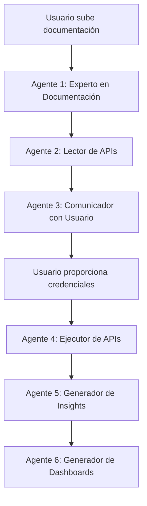

# Sistema de Agentes Especializados - DataLIVE

## 🎯 Arquitectura de Agentes

DataLIVE utiliza un sistema de **agentes especializados** que trabajan en secuencia para procesar documentación, ejecutar APIs y generar insights.



---

## 🤖 Agente 1: Experto en Documentación

**Archivo**: `backend/src/services/experts/document-expert.service.js`

### Capacidades

✅ **PDFs de hasta 1500+ páginas**
- Procesa PDFs completos sin límite de páginas
- Divide documentos grandes en secciones manejables
- Extrae metadata y estructura del documento

✅ **Scraping completo de sitios web**
- Navega automáticamente por sitios de documentación
- Detecta y sigue enlaces relevantes
- Extrae contenido de múltiples páginas
- Límite de profundidad configurable para evitar loops

✅ **Detección de formatos de API**
- OpenAPI/Swagger
- Postman Collections
- RAML
- API Blueprint
- WADL
- GraphQL
- REST
- SOAP/WSDL

✅ **Extracción de ejemplos de código**
- Bloques de código en Markdown
- Ejemplos de curl
- Snippets en múltiples lenguajes

### Funciones Principales

```javascript
// Leer PDF grande
const pdfData = await readLargePDF(fileBuffer);
// Retorna: { text, pages, sections, metadata }

// Scrapear sitio web completo
const webData = await scrapWebsite('https://api.example.com/docs');
// Retorna: { baseUrl, pages, totalPages, combinedText }

// Detectar formatos
const formats = detectAPIFormat(text);
// Retorna: ['openapi', 'rest', 'graphql']

// Extraer ejemplos
const examples = extractCodeExamples(text);
// Retorna: [{ language: 'curl', code: '...' }]
```

---

## 🤖 Agente 2: Lector de APIs

**Archivo**: `backend/src/services/ai/document-reader.service.js`

### Capacidades

✅ **Análisis profundo de documentación**
- Identifica todas las APIs mencionadas
- Extrae endpoints con métodos, parámetros y respuestas
- Detecta modelos de datos
- Identifica relaciones entre endpoints

✅ **Contexto por industria**
- Integra conocimiento del experto de industria
- Adapta el análisis según el tipo de negocio
- Identifica KPIs relevantes

### Proceso

1. Recibe documentación (PDF o web)
2. Analiza con IA usando contexto de industria
3. Extrae APIs y endpoints
4. Guarda en base de datos
5. Retorna estructura completa

---

## 🤖 Agente 3: Comunicador con Usuario

**Archivo**: `backend/src/services/experts/user-communicator.service.js`

### Capacidades

✅ **Explicaciones en lenguaje simple**
- Sin términos técnicos (no "endpoint", "header", "token")
- Usa ejemplos concretos
- Lenguaje cotidiano

✅ **Solicitud de credenciales amigable**
- Explica qué se necesita y por qué
- Indica dónde encontrar las credenciales
- Etiquetas simplificadas

✅ **Explicación de funcionalidades**
- Describe qué hace cada API
- Explica qué información necesita
- Indica qué información devuelve

### Funciones Principales

```javascript
// Explicar APIs descubiertas
const explanation = await explainDiscoveredAPIs(apiId, userId);
// Retorna: "Esta API te permite gestionar usuarios..."

// Solicitar credenciales
const request = await requestCredentials(apiId, authDetails, userId);
// Retorna: {
//   explanation: "Para usar esta API...",
//   simpleLabels: [{ name: 'api_key', label: 'Tu clave de acceso' }]
// }

// Explicar endpoint
const endpointExplanation = await explainEndpoint(endpoint, userId);
// Retorna: "Esta función te permite consultar..."

// Solicitar parámetros
const params = await requestParameters(endpoint, userId);
// Retorna: {
//   message: "Necesitamos algunos datos...",
//   parameters: [{ label: 'Fecha de inicio', example: '2026-01-01' }]
// }
```

---

## 🤖 Agente 4: Ejecutor de APIs

**Archivo**: `backend/src/services/ai/api-executor.service.js`

### Capacidades

✅ **Ejecución automática**
- Usa credenciales guardadas (no las vuelve a pedir)
- Construye headers automáticamente
- Maneja cualquier tipo de autenticación

✅ **Inferencia de parámetros**
- Si faltan parámetros, la IA los infiere
- Genera valores razonables según contexto

✅ **Explicaciones de resultados**
- Traduce respuestas técnicas a lenguaje simple
- Explica qué significa en términos de negocio

✅ **Ejecución masiva**
- Ejecuta todos los endpoints automáticamente
- Maneja errores individualmente
- Guarda historial completo

---

## 🤖 Agente 5: Generador de Insights

**Archivo**: `backend/src/services/experts/insight-agent.service.js`

### Capacidades

✅ **Análisis de datos**
- Analiza resultados de ejecuciones
- Identifica tendencias y patrones
- Detecta oportunidades y alertas

✅ **Insights de negocio**
- Genera recomendaciones accionables
- Usa contexto de industria
- Prioriza por importancia

✅ **Categorización**
- Tendencias (trends)
- Patrones (patterns)
- Recomendaciones (recommendations)
- Alertas (alerts)

### Ejemplo de Insight

```json
{
  "title": "Crecimiento en usuarios activos",
  "description": "Se detectó un incremento del 25% en usuarios activos...",
  "category": "trend",
  "priority": "high",
  "data": {
    "metric": "usuarios_activos",
    "value": "1,250",
    "comparison": "+25% vs mes anterior"
  },
  "recommendations": [
    "Aumentar capacidad de servidores",
    "Preparar campaña de retención"
  ]
}
```

---

## 🤖 Agente 6: Generador de Dashboards

**Archivo**: `backend/src/services/experts/dashboard-agent.service.js`

### Capacidades

✅ **Diseño automático de dashboards**
- Selecciona widgets apropiados según datos
- Organiza layout de forma intuitiva
- Incluye KPIs relevantes por industria

✅ **Tipos de widgets**
- Métricas (números grandes con tendencias)
- Gráficos (líneas, barras, pie, área)
- Tablas (datos tabulares)
- Listas (items ordenados)
- Gauges (indicadores circulares)

✅ **Configuración inteligente**
- Colores según valores (verde=bueno, rojo=malo)
- Tendencias automáticas
- Filtros relevantes
- Refresh automático

### Ejemplo de Dashboard

```json
{
  "name": "Dashboard de Usuarios",
  "widgets": [
    {
      "type": "metric",
      "title": "Usuarios Activos",
      "config": {
        "value": "1,250",
        "trend": "up",
        "trendValue": "+25%",
        "color": "green"
      }
    },
    {
      "type": "chart",
      "title": "Crecimiento Mensual",
      "chartConfig": {
        "type": "line",
        "data": [...]
      }
    }
  ]
}
```

---

## 🔄 Flujo Completo Garantizado

### 1. Usuario sube documentación

**Entrada**: PDF de 1500 páginas o URL de sitio web

**Agente 1** procesa:
- ✅ Lee PDF completo (sin límite de páginas)
- ✅ O scrapea sitio web completo (navega automáticamente)
- ✅ Detecta formatos de API
- ✅ Extrae ejemplos de código

### 2. Análisis de APIs

**Agente 2** analiza:
- ✅ Descubre todas las APIs
- ✅ Extrae todos los endpoints
- ✅ Identifica parámetros y respuestas
- ✅ Detecta métodos de autenticación

### 3. Comunicación con usuario

**Agente 3** explica:
- ✅ "Esta API te permite gestionar usuarios, productos y órdenes..."
- ✅ "Para usarla, necesitas una clave de acceso que puedes encontrar..."
- ✅ Muestra formulario simple con etiquetas amigables

### 4. Usuario proporciona credenciales

**Una sola vez**:
```
Tu clave de acceso: [sk_live_abc123]
[Guardar Credenciales]
```

✅ Guardadas en BD → No se vuelven a pedir

### 5. Ejecución automática

**Agente 4** ejecuta:
- ✅ Usa credenciales guardadas
- ✅ Ejecuta TODOS los endpoints automáticamente
- ✅ Solo pide parámetros necesarios en lenguaje simple
- ✅ Genera explicaciones: "Se consultaron 150 usuarios activos..."

### 6. Generación de insights

**Agente 5** analiza:
- ✅ Identifica tendencias
- ✅ Detecta patrones
- ✅ Genera recomendaciones
- ✅ Prioriza por importancia

### 7. Creación de dashboard

**Agente 6** crea:
- ✅ Dashboard interactivo
- ✅ Widgets apropiados
- ✅ KPIs relevantes
- ✅ Visualizaciones claras

---

## ✅ Garantías del Sistema

### 1. Documentación

✅ **PDFs grandes**: Hasta 1500+ páginas sin problema  
✅ **Sitios web**: Scraping completo automático  
✅ **Todos los formatos**: OpenAPI, Postman, RAML, GraphQL, REST, SOAP  

### 2. Credenciales

✅ **Una sola vez**: Usuario las proporciona una vez  
✅ **Guardadas**: Almacenadas en BD de forma segura  
✅ **Nunca se vuelven a pedir**: Sistema las usa automáticamente  

### 3. Ejecución

✅ **Automática**: Todos los endpoints se ejecutan solos  
✅ **Simple**: Solo pide parámetros necesarios  
✅ **Lenguaje natural**: Sin términos técnicos  

### 4. Comunicación

✅ **Explicaciones simples**: "Esta función consulta usuarios..."  
✅ **Sin jerga técnica**: No "endpoint", "header", "token"  
✅ **Ejemplos concretos**: Valores de ejemplo claros  

### 5. Insights

✅ **Automáticos**: Se generan de los datos  
✅ **Relevantes**: Según industria  
✅ **Accionables**: Con recomendaciones  

### 6. Dashboards

✅ **Automáticos**: Se crean solos  
✅ **Interactivos**: Con filtros y refresh  
✅ **Visuales**: Gráficos y métricas claras  

---

## 🎯 Resumen

El sistema **GARANTIZA**:

1. ✅ Leer PDFs de 1500+ páginas
2. ✅ Scrapear sitios web completos
3. ✅ Detectar todos los formatos de API
4. ✅ Pedir credenciales UNA SOLA VEZ
5. ✅ Ejecutar TODAS las APIs automáticamente
6. ✅ Explicar TODO en lenguaje simple
7. ✅ Generar insights de negocio
8. ✅ Crear dashboards interactivos

**Sin necesidad de conocimientos técnicos**
