# Sistema de Ejecución Automática de APIs - DataLIVE

## 🎯 Objetivo

Permitir que el usuario proporcione sus credenciales **UNA SOLA VEZ** y luego ejecutar **TODAS las APIs automáticamente** sin volver a pedirlas, solicitando solo los parámetros necesarios de forma simple.

---

## 🔄 Flujo Completo

```mermaid
graph TD
    A[Usuario sube documentación] --> B[IA 1: Descubre APIs y Endpoints]
    B --> C[IA 2: Detecta método de autenticación]
    C --> D[Usuario proporciona credenciales UNA VEZ]
    D --> E[Sistema guarda credenciales en BD]
    E --> F[IA 3: Ejecuta TODOS los endpoints automáticamente]
    F --> G[Solo pide parámetros necesarios de forma simple]
    G --> H[Genera explicaciones en lenguaje natural]
    H --> I[Guarda historial de ejecuciones]
```



---

## 📋 Componentes Implementados

### 1. IA 2: Detector de Autenticación

**Archivo**: `backend/src/services/ai/auth-detector.service.js`

**Funciones**:

#### `detectAuthenticationMethod(apiId, documentText, userId)`
Analiza la documentación y detecta:
- **Tipo de autenticación**: API Key, OAuth, JWT, Basic Auth, Bearer Token
- **Ubicación**: Header, Query Parameter, Body
- **Nombres de campos**: Exactos (ej: "X-API-Key", "Authorization")
- **Formato requerido**: Ej: "Bearer {token}", "Basic {base64}"
- **Credenciales necesarias**: Lista de qué debe proporcionar el usuario
- **Flujo de autenticación**: Si necesita login previo, refresh tokens, etc.

**Ejemplo de respuesta**:
```json
{
  "authType": "bearer",
  "location": "header",
  "fieldName": "Authorization",
  "format": "Bearer {value}",
  "credentialsNeeded": [
    {
      "name": "api_key",
      "label": "API Key",
      "description": "Tu clave de API",
      "type": "password",
      "required": true
    }
  ],
  "authFlow": {
    "requiresLogin": false,
    "loginEndpoint": null,
    "tokenField": null,
    "refreshable": false
  }
}
```

#### `saveCredentials(apiId, credentials, userId)`
Guarda las credenciales del usuario en la base de datos:
- Se guardan **una sola vez**
- Se asocian a la API específica
- Se pueden actualizar si es necesario
- TODO: Encriptar en producción

#### `getCredentials(apiId)`
Recupera las credenciales guardadas para usar en las ejecuciones

---

### 2. IA 3: Ejecutor Universal de APIs

**Archivo**: `backend/src/services/ai/api-executor.service.js`

**Funciones principales**:

#### `executeEndpoint(apiId, endpoint, userParams, userId, projectId)`

Ejecuta un endpoint específico de forma completamente automática:

**Paso 1**: Obtiene información de la API
```javascript
const { data: api } = await supabase
  .from('apis')
  .select('*, auth_details')
  .eq('id', apiId)
  .single();
```

**Paso 2**: Obtiene credenciales guardadas (sin pedirlas al usuario)
```javascript
const credentials = await getCredentials(apiId);
```

**Paso 3**: Construye headers de autenticación automáticamente
```javascript
const headers = await buildAuthHeaders(api, credentials);
// Resultado: { "Authorization": "Bearer abc123xyz" }
```

**Paso 4**: Infiere parámetros faltantes con IA
```javascript
const finalParams = await inferMissingParams(endpoint, userParams, userId, projectId);
```
- Si el usuario no proporciona un parámetro requerido, la IA genera un valor razonable
- Ejemplo: Si falta "fecha", la IA puede inferir "hoy"

**Paso 5**: Construye URL completa
```javascript
const url = buildUrl(api.base_url, endpoint.path, finalParams.query);
// Resultado: https://api.example.com/users?limit=10&page=1
```

**Paso 6**: Ejecuta el request
```javascript
const response = await axios({
  method: endpoint.method,
  url,
  headers,
  data: finalParams.body,
  timeout: 30000
});
```

**Paso 7**: Genera explicación en lenguaje simple
```javascript
const explanation = await generateExplanation(endpoint, finalParams, response, userId, projectId);
```

**Ejemplo de explicación**:
> "Se solicitó la lista de usuarios activos del sistema. La API respondió exitosamente con 25 usuarios encontrados. Esto significa que actualmente hay 25 personas registradas y activas en la plataforma."

**Paso 8**: Guarda todo en la base de datos
```javascript
await supabase.from('executions').insert({
  api_id: apiId,
  endpoint: endpoint.path,
  method: endpoint.method,
  request_params: finalParams,
  response_status: response.status,
  response_data: response.data,
  response_time: responseTime,
  ai_explanation: explanation
});
```

#### `executeAllEndpoints(apiId, userId, projectId)`

Ejecuta **TODOS** los endpoints de una API automáticamente:

```javascript
for (const endpoint of api.endpoints) {
  const result = await executeEndpoint(apiId, endpoint, {}, userId, projectId);
  results.push(result);
}
```

**Ventajas**:
- ✅ No pide credenciales (ya están guardadas)
- ✅ Infiere parámetros automáticamente
- ✅ Genera explicaciones para cada resultado
- ✅ Guarda historial completo

---

### 3. Rutas de API

**Archivo**: `backend/src/routes/execution.routes.js`

#### `POST /api/execution/detect-auth/:apiId`
Detecta el método de autenticación de una API

**Request**:
```json
{}
```

**Response**:
```json
{
  "authType": "bearer",
  "location": "header",
  "fieldName": "Authorization",
  "format": "Bearer {value}",
  "credentialsNeeded": [...]
}
```

#### `POST /api/execution/save-credentials/:apiId`
Guarda las credenciales del usuario (UNA SOLA VEZ)

**Request**:
```json
{
  "credentials": {
    "api_key": "tu-clave-secreta-aqui"
  }
}
```

**Response**:
```json
{
  "message": "Credenciales guardadas exitosamente"
}
```

#### `POST /api/execution/execute/:apiId/:endpointIndex`
Ejecuta un endpoint específico

**Request**:
```json
{
  "params": {
    "limit": 10,
    "page": 1
  }
}
```

**Response**:
```json
{
  "execution": {
    "id": "uuid",
    "status": "success",
    "response_status": 200,
    "response_data": {...},
    "ai_explanation": "Se solicitó...",
    "response_time": 234
  },
  "response": {...},
  "status": 200,
  "explanation": "Se solicitó...",
  "responseTime": 234
}
```

#### `POST /api/execution/execute-all/:apiId`
Ejecuta **TODOS** los endpoints automáticamente

**Request**:
```json
{}
```

**Response**:
```json
{
  "total": 15,
  "successful": 14,
  "failed": 1,
  "results": [
    {
      "endpoint": "/users",
      "success": true,
      "result": {...}
    },
    {
      "endpoint": "/products",
      "success": true,
      "result": {...}
    }
  ]
}
```

#### `GET /api/execution/history/:apiId`
Obtiene el historial de ejecuciones

**Response**:
```json
[
  {
    "id": "uuid",
    "endpoint": "/users",
    "method": "GET",
    "status": "success",
    "response_status": 200,
    "ai_explanation": "...",
    "created_at": "2026-01-06T16:00:00Z"
  }
]
```

---

## 🎬 Ejemplo de Uso Completo

### Paso 1: Usuario sube documentación de API

```javascript
// Frontend
const formData = new FormData();
formData.append('file', pdfFile);
formData.append('projectId', projectId);
formData.append('type', 'pdf');

await api.post('/api/documents/upload', formData);
```

**Resultado**: IA 1 descubre automáticamente todos los endpoints

### Paso 2: Sistema detecta autenticación

```javascript
// Frontend
const authDetails = await api.post(`/api/execution/detect-auth/${apiId}`);

// authDetails contiene:
{
  "authType": "api_key",
  "credentialsNeeded": [
    {
      "name": "api_key",
      "label": "API Key",
      "description": "Tu clave de API de ejemplo.com",
      "type": "password"
    }
  ]
}
```

### Paso 3: Usuario proporciona credenciales UNA VEZ

```javascript
// Frontend muestra formulario simple
<input 
  type="password" 
  placeholder="API Key"
  value={apiKey}
  onChange={(e) => setApiKey(e.target.value)}
/>

// Usuario ingresa: "sk_live_abc123xyz"

// Guardar
await api.post(`/api/execution/save-credentials/${apiId}`, {
  credentials: {
    api_key: apiKey
  }
});
```

**✅ Credenciales guardadas. No se volverán a pedir.**

### Paso 4: Ejecutar TODAS las APIs automáticamente

```javascript
// Frontend - Un solo botón
<button onClick={executeAll}>
  Ejecutar Todas las APIs
</button>

const executeAll = async () => {
  const results = await api.post(`/api/execution/execute-all/${apiId}`);
  
  // results contiene:
  {
    "total": 10,
    "successful": 10,
    "failed": 0,
    "results": [...]
  }
};
```

**✅ Sistema ejecuta automáticamente:**
- GET /users
- GET /products
- GET /orders
- POST /analytics
- ... (todos los endpoints encontrados)

**Sin pedir credenciales nuevamente**

### Paso 5: Ver resultados con explicaciones simples

```javascript
// Cada resultado tiene una explicación en lenguaje natural
{
  "endpoint": "/users",
  "explanation": "Se consultó la lista de usuarios del sistema. La API respondió con 150 usuarios activos. Esto significa que hay 150 personas registradas actualmente en la plataforma."
}

{
  "endpoint": "/products",
  "explanation": "Se solicitó el catálogo de productos disponibles. La API devolvió 45 productos en stock. Estos son los artículos que actualmente están disponibles para venta."
}
```

---

## 🔒 Seguridad

### Credenciales en Base de Datos

Actualmente las credenciales se guardan en texto plano en la tabla `credentials`:

```sql
CREATE TABLE credentials (
    id UUID PRIMARY KEY,
    api_id UUID REFERENCES apis(id),
    key VARCHAR(255),
    value TEXT,  -- TODO: Encriptar
    description TEXT
);
```

### TODO: Encriptación en Producción

```javascript
import crypto from 'crypto';

const ENCRYPTION_KEY = process.env.ENCRYPTION_KEY; // 32 bytes
const IV_LENGTH = 16;

function encrypt(text) {
  const iv = crypto.randomBytes(IV_LENGTH);
  const cipher = crypto.createCipheriv('aes-256-cbc', Buffer.from(ENCRYPTION_KEY), iv);
  let encrypted = cipher.update(text);
  encrypted = Buffer.concat([encrypted, cipher.final()]);
  return iv.toString('hex') + ':' + encrypted.toString('hex');
}

function decrypt(text) {
  const parts = text.split(':');
  const iv = Buffer.from(parts.shift(), 'hex');
  const encryptedText = Buffer.from(parts.join(':'), 'hex');
  const decipher = crypto.createDecipheriv('aes-256-cbc', Buffer.from(ENCRYPTION_KEY), iv);
  let decrypted = decipher.update(encryptedText);
  decrypted = Buffer.concat([decrypted, decipher.final()]);
  return decrypted.toString();
}
```

---

## 🎯 Ventajas del Sistema

### ✅ Para el Usuario

1. **Simplicidad extrema**:
   - Sube documentación
   - Proporciona credenciales UNA VEZ
   - Click en "Ejecutar Todas las APIs"
   - Listo

2. **Sin conocimientos técnicos**:
   - No necesita saber qué es un header
   - No necesita saber qué es Bearer Token
   - No necesita entender JSON
   - Explicaciones en lenguaje natural

3. **Ahorro de tiempo**:
   - No configurar cada endpoint manualmente
   - No copiar/pegar credenciales repetidamente
   - Ejecución masiva automática

### ✅ Para el Sistema

1. **Inteligente**:
   - Detecta automáticamente el tipo de autenticación
   - Infiere parámetros faltantes
   - Adapta el formato de credenciales

2. **Robusto**:
   - Maneja errores de API
   - Timeout de 30 segundos
   - Guarda historial completo
   - Logging detallado

3. **Escalable**:
   - Funciona con cualquier tipo de API
   - Soporta múltiples métodos de autenticación
   - Extensible a nuevos tipos

---

## 🚀 Próximos Pasos

### Frontend Necesario

Crear páginas para:

1. **Configuración de Credenciales**:
```jsx
// frontend/src/app/dashboard/projects/[id]/credentials/page.js
- Mostrar qué credenciales se necesitan
- Formulario simple para ingresarlas
- Botón "Guardar Credenciales"
- Indicador de "Credenciales configuradas ✓"
```

2. **Ejecución de APIs**:
```jsx
// frontend/src/app/dashboard/projects/[id]/execute/page.js
- Lista de endpoints descubiertos
- Botón "Ejecutar Todas las APIs"
- Botón individual por endpoint
- Formulario simple para parámetros opcionales
```

3. **Historial de Ejecuciones**:
```jsx
// frontend/src/app/dashboard/projects/[id]/history/page.js
- Lista de ejecuciones pasadas
- Explicaciones en lenguaje natural
- Filtros por endpoint, fecha, estado
- Ver detalles de cada ejecución
```

---

## 📊 Resumen

El sistema **GARANTIZA** la ejecución simple de cualquier endpoint:

✅ **Credenciales**: Se piden UNA SOLA VEZ y se guardan  
✅ **Autenticación**: Se maneja automáticamente  
✅ **Parámetros**: Se infieren con IA si faltan  
✅ **Ejecución**: Automática para todos los endpoints  
✅ **Explicaciones**: En lenguaje natural simple  
✅ **Historial**: Todo se guarda para consulta  

**El usuario solo necesita**:
1. Subir documentación
2. Ingresar credenciales una vez
3. Click en "Ejecutar"
4. Leer explicaciones simples

**Sin necesidad de entender de APIs, headers, tokens, JSON, etc.**
